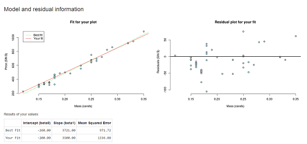

---
title       : Exploring residual analysis
subtitle    : Fitting a linear model to the diamonds dataset
author      : Victor van den Broek
job         : Managing Director
logo        : Logo_Maneros-small.png        
framework   : io2012        # {io2012, html5slides, shower, dzslides, ...}
highlighter : highlight.js  # {highlight.js, prettify, highlight}
hitheme     : tomorrow      # 
widgets     : [mathjax]          # {mathjax, quiz, bootstrap}
mode        : selfcontained # {standalone, draft}
knit        : slidify::knit2slides
--- 

## Introduction

In the regression class, students learn about residual analysis. After fitting a model to data, you can explore the residuals to find out if there is still a pattern in the data. It is very helpful for understanding such residual analysis if you can slightly change a model and see what happens to the residuals.


For this purpose, I developed a shiny app that fits the best-fit model, and the user provided model to the diamonds data from UsingR. This dataset contains 91 observations of diamonds, their price in singapore dollars and their size in carat.


--- .class #id bg:#FFF8DC

## The math

The following linear regression model is fit, both using the default lm method and the intercept and slope entered by the user:

$$\Large Y = \beta_0 + \beta_1 * carat + \epsilon$$

The best fit model is found using R's lm function:


```r
library(UsingR)
```


```r
data(diamond)
fit <- lm(price ~ carat, diamond)
fit$coefficients
```

```
## (Intercept)       carat 
##   -259.6259   3721.0249
```

---.class #id bg:#EEE8CC

## The math continued

The mean square error is also computed of the provided fit, using the following formula:

$$\Large MSE = \frac{1}{n} \sum\limits_{i=1}^n (\hat{Y_i} - Y_i)^2$$

Resulting for example with an intercept of -200 and a slope of 3500 in a MSE of:


```r
mean(((-200 + 3500 * diamond$carat) - diamond$price )^2)
```

```
## [1] 1336.083
```

Finally the user also has the possibility to substract the mean of the observed price and carats, so that the regression line will pass through the origin (ie, intercept = 0)

---.class #id bg:#DDD8BC

## Pictures please!

The provided fit is also fit to the data, and a residual plot is created. In the previous example of the intercept at -200 and the slope at 3500, this would provide the following picture:



Clearly this app helps users understand the residual analysis and formed patterns more intuitively! Incorporating this app into the regression class will help the world.

Thanks for your attention.


